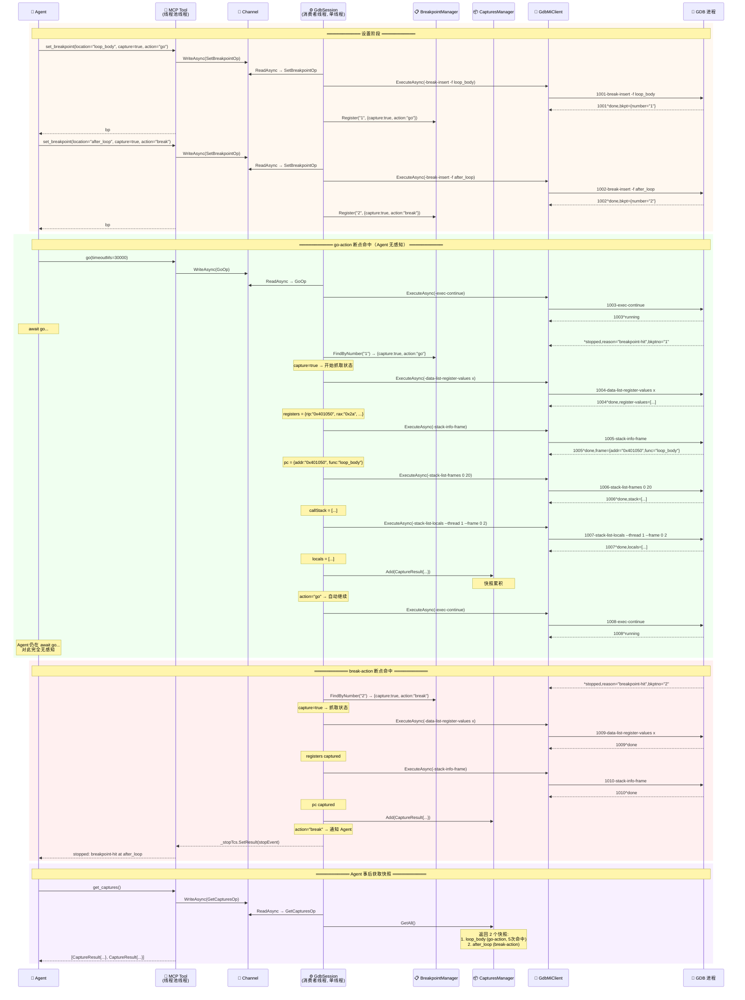

# GdbMiBridge.Mcp — MCP GDB Debug Server 设计

## 目标

基于 `GdbMiClient` 库，构建一个 MCP (Model Context Protocol) server，让 AI agent 通过 MI 协议控制 GDB 调试 C/C++ 程序。Tool 接口对标 WinDbg 后端（`docs/windbg-backend-reference.md`），实现 32 个调试 tool。

## 架构

```
┌─────────────────────────────────────────────────────────────┐
│                     MCP Server (stdio)                       │
│  Program.cs: 注册 McpServer, 绑定 tool handlers             │
├─────────────────────────────────────────────────────────────┤
│  Tool Handlers (MCP 线程池)                                  │
│  每个 MCP tool → await _session.SendOperationAsync(op)      │
├─────────────── Channel<SessionOperation> ────────────────────┤
│                   GdbSession (消费者线程, 单线程)             │
│  ┌──────────────────────────────────────┐                   │
│  │  消费者 loop:                         │                   │
│  │  ① Channel.Read → Operation          │                   │
│  │  ② 调用 GdbMiClient.ExecuteAsync()   │                   │
│  │  ③ 等 GDB 响应 → 返回给 tool 调用者    │                   │
│  │  ④ 处理 *stopped (异步事件):          │                   │
│  │     查 BreakpointManager              │                   │
│  │     capture 状态（如配置）              │                   │
│  │     go? → -exec-continue              │                   │
│  │     break? → 通知 Agent (_stopTcs)     │                   │
│  │  ⑤ 处理 ~ @ & = 输出                  │                   │
│  └──────────────────────────────────────┘                   │
│                                                             │
│  ├── BreakpointManager    ← 断点配置 + go/break 决策        │
│  ├── CapturesManager      ← 捕获快照列表                     │
│  └── _client: GdbMiClient ← MI 协议引擎                      │
│        └── ITransport ──→ GDB 进程                           │
├─────────────────────────────────────────────────────────────┤
│                    GdbMiClient 库                             │
│  (不变，纯 MI 协议层)                                         │
└─────────────────────────────────────────────────────────────┘
```

## 核心设计决策

| 决策 | 内容 |
|------|------|
| **MCP transport** | stdio，单客户端 |
| **.NET MCP SDK** | `ModelContextProtocol` NuGet (官方 preview)，用 `WithStdioServerTransport()` |
| **消费者线程 = 唯一线程** | BreakpointManager、CapturesManager、GDB I/O 全在消费者线程，无锁 |
| **go-action vs break-action** | 完全在消费者线程内完成，Agent 看不到 go-action 命中的中间步骤 |
| **Session 生命周期** | `create`/`attach`/`load_dump` 开始 → `terminate`/`detach` 结束，管理器全部清空 |
| **多 Session 预留** | 当前一个 MCP server 一个 Session，MCP tool handler 通过 `SendOperationAsync` 接入，未来可插路由层 |
| **命令序列化** | Consumer 线程内 `await tcs.Task`，自然串行，无需额外锁 |
| ***stopped 事件** | Consumer 线程直接处理，不走 Channel，同线程无竞态 |

## 项目结构

```
C:\Code\GdbMiClient\
├── GdbMiClient.slnx
├── src/
│   ├── GdbMiClient/              ← 已有库
│   └── GdbMiBridge.Mcp/          ← 新建 MCP server
│       ├── GdbMiBridge.Mcp.csproj
│       ├── Program.cs             ← 入口，注册 MCP tools
│       ├── GdbSession.cs          ← 消费者线程 + Channel 编排
│       ├── BreakpointManager.cs   ← 断点配置 + go/break 决策
│       ├── CapturesManager.cs     ← 捕获快照管理
│       ├── SessionOperation.cs    ← Channel 消息类型
│       ├── CaptureResult.cs       ← 捕获快照数据模型
│       └── ToolHandlers/          ← MCP tool 实现
│           ├── SessionTools.cs    ← create, attach, detach, terminate, status
│           ├── ExecutionTools.cs  ← go, step_*, go_to
│           ├── BreakpointTools.cs ← set_bp, remove_bp, enable/disable, list
│           ├── StateTools.cs      ← registers, memory, stack, threads, variables, captures, pc
│           ├── SymbolTools.cs     ← symbol/address resolution, disassembly, modules
│           └── RawTools.cs        ← raw_gdb
├── tests/
│   └── GdbMiClient.Tests/         ← 已有测试
└── docs/
    └── windbg-backend-reference.md
```

## GdbSession 设计

```csharp
public class GdbSession : IDisposable
{
    private readonly Channel<SessionOperation> _channel;
    private readonly GdbMiClient _client;
    private readonly ITransport _transport;
    private readonly BreakpointManager _bpManager;
    private readonly CapturesManager _captures;
    private Task _consumerLoop;

    // ─── MCP Tool 入口（任意线程调用） ───

    public Task<T> SendOperationAsync<T>(SessionOperation op);
    public Task<StopEvent> WaitForStopAsync(CancellationToken ct);

    // ─── 生命周期 ───

    public async Task StartAsync(CancellationToken ct);  // 启动消费者 loop
    public async Task StopAsync();                         // 终止 GDB + 清理
    public DebuggerState State { get; }

    // ─── Consumer 线程执行 ───

    private async Task ConsumerLoopAsync(CancellationToken ct);
    private void OnStopped(StopEvent evt);   // 查 BreakpointManager → capture → go/break
    private void OnOutput(string text);      // 路由到 output stream
}

// Channel 消息类型
public abstract record SessionOperation;
public record SetBreakpointOp(string Location, bool Capture, string Action, string? Condition)
    : SessionOperation;
public record GoOp(int TimeoutMs) : SessionOperation;
// ... 每种 tool 对应一个 record
```

## BreakpointManager

```csharp
internal class BreakpointManager
{
    private readonly Dictionary<string, BreakpointConfig> _bps = new();

    public void Register(string bpNumber, BreakpointConfig config);
    public void Remove(string bpNumber);
    public BreakpointConfig? FindByNumber(string bpNumber);
    public void Clear();

    // 核心：*stopped 时决定行为
    public (bool ShouldCapture, bool ShouldContinue) OnHit(string bpNumber);
}

internal record BreakpointConfig(
    string BpNumber,       // GDB 断点号
    string Location,       // 原始 location 字符串（函数名/文件:行号/地址）
    bool Capture,          // 命中时是否抓取状态
    string Action,         // "go" | "break"
    string? Condition      // 条件表达式
);
```

## CapturesManager

```csharp
internal class CapturesManager
{
    private readonly List<CaptureResult> _captures = new();

    public void Add(CaptureResult capture);
    public IReadOnlyList<CaptureResult> GetAll();
    public void Clear();
}

public record CaptureResult(
    string BreakpointNumber,
    string BreakpointLocation,
    Dictionary<string, string> Registers,
    ProgramCounterInfo ProgramCounter,
    List<FrameInfo> CallStack,
    MemoryData? Memory,
    List<VariableInfo> LocalVariables,
    DateTimeOffset Timestamp
);
```

## Auto-Capture 流程



**要点：**

| # | 关键行为 | 说明 |
|---|---------|------|
| ① | go-action 命中 → Agent 无感知 | 消费者线程查配置 → capture → 自动 `-exec-continue`，Agent 的 `go()` await 一直不返回 |
| ② | capture 是同步阻塞操作 | 停在断点时，依次调 MI 命令收集 registers / pc / stack / locals，都是在 Consumer 线程串行完成 |
| ③ | break-action 命中 → 通知 Agent | capture 完成后设 `_stopTcs`，Agent 的 `go()` await 返回，得到 `"breakpoint_hit"` |
| ④ | 多个 go-action 命中累积在同一列表 | CapturesManager 不分 go/break，统一累积，Agent 事后 `get_captures()` 一次性拿到 |

## Tool 列表（32 个，对标 WinDbg 后端）

### Session (6)
| Tool | 参数 | 说明 |
|------|------|------|
| `create` | `executable`, `arguments?`, `workingDirectory?`, `stop_at_entry?` | 启动可执行文件进入调试 |
| `attach` | `pid` | 附加到进程 |
| `load_dump` | `path` | 加载 core dump |
| `detach` | — | 分离，目标继续运行 |
| `terminate` | — | 终止目标 + 清理 session |
| `status` | — | 返回 `{ state, backend }` |

### Execution (5)
| Tool | 参数 | 说明 |
|------|------|------|
| `go` | `timeoutMs?` | 继续执行直到停止事件或超时 |
| `step_into` | — | 单步进入 |
| `step_over` | — | 单步跳过 |
| `step_out` | — | 单步返回 |
| `go_to` | `location` | 运行到指定位置（临时断点） |

### Breakpoint (5)
| Tool | 参数 | 说明 |
|------|------|------|
| `set_breakpoint` | `location`, `capture?`, `action?`, `condition?` | 设软件断点 |
| `remove_breakpoint` | `id` | 删除断点 |
| `enable_breakpoint` | `id` | 启 用 |
| `disable_breakpoint` | `id` | 禁用 |
| `list_breakpoints` | — | 列出所有断点 |

### State (10)
| Tool | 参数 | 说明 |
|------|------|------|
| `get_registers` | — | 所有寄存器 |
| `get_reg` | `name` | 单个寄存器 |
| `get_program_counter` | — | PC + 符号 + 指令 |
| `read_memory` | `address`, `size?` | 读内存 |
| `get_call_stack` | `maxFrames?` | 调用栈 |
| `list_threads` | — | 线程列表 |
| `get_local_variables` | `frameIndex?` | 局部变量 |
| `capture_state` | — | 手动触发状态快照 |
| `get_captures` | — | 获取所有累积快照 |
| `clear_captures` | — | 清空快照 |

### Symbol (5)
| Tool | 参数 | 说明 |
|------|------|------|
| `resolve_symbol` | `name` | 符号 → 地址 |
| `address_to_symbol` | `address` | 地址 → 符号 |
| `find_symbols` | `pattern` | 搜索符号 |
| `disassemble` | `address`, `count?` | 反汇编 |
| `list_modules` | — | 模块列表 |

### Escape Hatch (1)
| Tool | 参数 | 说明 |
|------|------|------|
| `raw_gdb` | `command` | 执行任意 GDB MI/CLI 命令 |

## 与 GdbMiClient 的关系

`GdbMiClient` 库 **不作修改**。`GdbSession` 是它的唯一使用者：

- 命令发送：通过 `GdbMiClient.ExecuteAsync()` → 在 Consumer 线程串行
- 行处理：`GdbMiClient.ProcessLine()` → Consumer 线程调用（合并 ReadLoop）
- 异步事件：`GdbMiClient.WaitForStopAsync()` → 不再直接暴露给 MCP；GdbSession 内部处理
- 控制台输出：`GdbMiClient.GetOutputStream()` → GdbSession 路由给 MCP 输出

`GdbMiChannel` 被废除（其功能被 `GdbSession` 吸收并增强）。

## 错误处理策略

| 场景 | 处理 |
|------|------|
| GDB 崩溃/退出 | `GdbSession` 检测到 IsClosed → 设 State=Exited → 返回错误给 tool 调用者 |
| MI 命令返回 error | `ExecuteAsync` 返回 `ResultClass.Error` → tool handler 提取 msg 抛给 Agent |
| 超时 (go timeout) | Consumer 用 `CancellationTokenSource` 计时 → 超时时发 `-exec-interrupt` |
| 无效 location | GDB 返回 error → tool handler 返回友好错误信息 |
| Session 未就绪时调 tool | 检查 State → 返回 "No active session" 错误 |

## 验证方案

1. **单元测试**：Mock `GdbMiClient`（通过 `ITransport` mock），测试 GdbSession 的 Consumer Loop 逻辑、BreakpointManager 的 go/break 决策、CapturesManager 的累积
2. **集成测试**：真实 GDB 进程，端到端测试 `create` → `set_breakpoint` → `go` → `get_captures` 流程
3. **MCP 协议测试**：用 MCP client 连接 server，调 tool 验证 JSON-RPC 交互
